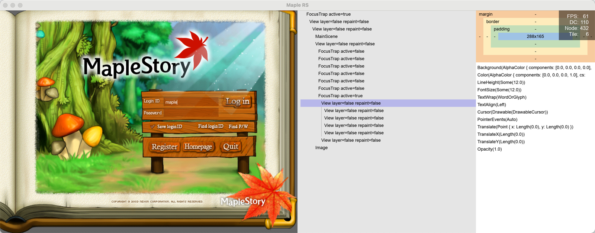
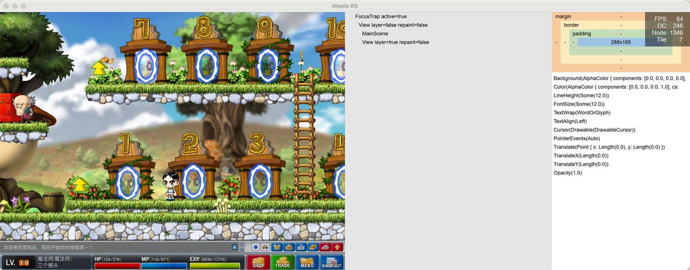
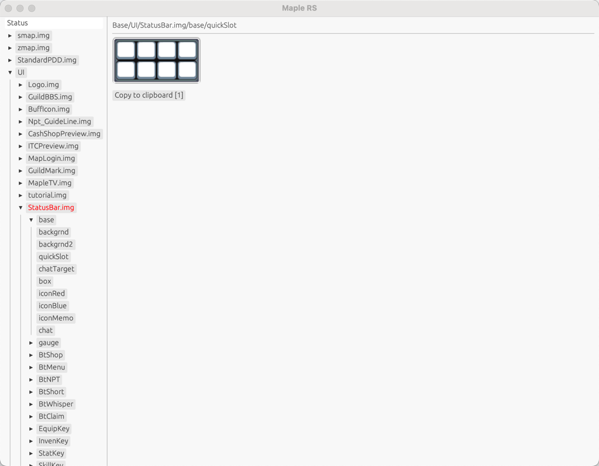

# Maple RS - GMS 083

- 一个探索用现代 Rust 技术栈重建 GMS 083 客户端的实验性项目。
- 当前为概念验证阶段，仅实现基础框架与核心模块原型，尚未达到可玩状态。

## 🚀 快速开始


### 1. 克隆仓库
```bash
git clone --recursive https://github.com/wuzekang/maple-rs.git
```

### 2. 资源下载

- QQ群：1042028998
- 群分享下载 Data.zip 解压到 maple-rs/Data 目录

### 3. 构建运行
```bash
cd maple-rs
cargo run --bin client
cargo run --bin editor
```

## 🖥️ 运行效果
 
### crates/client



### crates/editor


## ⚙️ 技术栈

- **界面布局**：taffy
- **图形渲染**：sdl3-sys
- **文本渲染**：cosmic-text

## 🏗️ 项目结构

```text
crates
├── client              # 主客户端实现（游戏主循环核心）
│   ├── app             # 根组件（登录/角色选择/地图切换）
│   ├── scene           # 地图场景渲染
│   ├── map             # 地图加载
│   └── wz              # 资源加载
├── editor              # WZ结构预览
├── reactive            # 响应式核心（类Solid）
├── ui                  # 响应式UI框架
│   ├── render          # 渲染抽象层
│   │   └── command.rs  # 绘制指令
│   ├── widget          # 组件化UI系统
│   │   ├── debug       # DevTools（元素审查/FPS面板）
│   │   ├── dynamic     # 动态内容渲染器（支持条件渲染/异步加载）
│   │   ├── focus_trap  # 焦点管理
│   │   ├── text        # 文本渲染
│   │   ├── text_input  # 文本输入组件
│   │   ├── dynamic     # 动态内容渲染器（支持条件渲染/异步加载）
│   │   └── scroll_view # 滚动容器
│   └── geometry/       # 数学基础库（含贝塞尔曲线计算）
└── wz-reader-rs        # WZ解析库
```

## 🤝 贡献指南

欢迎通过 Issue 和 PR 参与以下方向：
- 新功能开发
- 性能优化
- 平台兼容性改进
- 文档翻译

## 📜 免责声明

本项目为学习研究目的开发，不包含任何游戏资源文件。游戏版权归 NEXON 所有，请通过合法渠道获取游戏客户端。