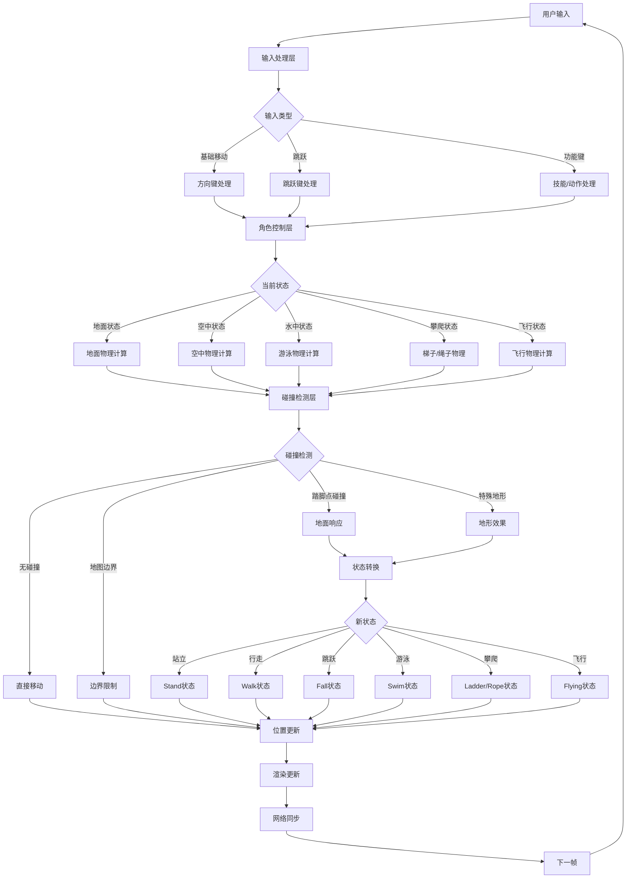

# 冒险岛角色控制移动系统完整分析

## 系统流程图



## 1. 概述

### 1.1 系统简介

MapleStory的角色移动系统是一个精心设计的2D平台游戏物理引擎，支持行走、跳跃、飞行、游泳、攀爬等多种移动方式。本文档基于逆向工程分析，详细介绍了该系统的设计和实现。

### 1.2 核心特性

- **物理真实感**: 重力、摩擦力、斜坡、传送带等真实物理效果
- **丰富的移动状态**: 支持20+种不同的移动状态和状态转换
- **高性能优化**: 空间分割树、对象池、批量碰撞检测
- **安全机制**: 数据加密、完整性检查、服务器验证
- **精确控制**: 60 FPS目标帧率，亚像素精度

## 2. 系统架构

### 2.1 层次结构

```
用户输入层 (CInputSystem)
    ↓ 键盘/手柄输入
输入处理层 (CSequencedKeyMan, CFuncKeyMappedMan)
    ↓ 按键映射、连击检测
角色控制层 (CVecCtrlUser)
    ↓ 状态管理、动作解析
物理计算层 (CVecCtrl)
    ↓ 速度、加速度、力的计算
碰撞检测层 (CWvsPhysicalSpace2D)
    ↓ 地形交互、边界检测
渲染更新层
    ↓ 位置同步、动画播放
网络同步层
```

### 2.2 关键组件

#### 2.2.1 输入系统 (CInputSystem)
```cpp
class CInputSystem {
    static CInputSystem* ms_pInstance;  // 单例实例 (0xc68c20)
    // DirectInput8 接口封装
    // 键盘状态缓冲和更新
};
```

#### 2.2.2 角色控制器 (CVecCtrlUser)
```cpp
class CVecCtrlUser : public CVecCtrl {
    bool m_bUserFlyingSkill;           // 飞行技能状态
    int m_nMaxFreeFallTickCount;       // 最大自由落体时间
    bool m_bForceFlush;                // 强制刷新标记
    DWORD m_tSentDebugRegister;        // 调试注册时间
};
```

#### 2.2.3 物理空间管理器 (CWvsPhysicalSpace2D)
```cpp
class CWvsPhysicalSpace2D {
    TRSTree<...> m_rtFoothold;         // 空间分割树（四叉树）
    ZMap<...> m_mFoothold;             // 踏脚点快速查找表
    double dWalkForce[14];             // 物理参数数组
    double dJumpSpeed;                 // 跳跃初速度
    double dMaxFriction;               // 最大摩擦系数
    double dMinFriction;               // 最小摩擦系数
};
```

## 3. 基础概念

### 3.1 坐标系统

- **世界坐标**: 整个地图的绝对坐标系
- **相对坐标**: 相对于踏脚点的位置
- **屏幕坐标**: 用于渲染的视口坐标

### 3.2 基本物理量

| 物理量 | 单位 | 说明 |
|--------|------|------|
| 位置 (x, y) | 像素 | 角色在世界中的位置 |
| 速度 (vx, vy) | 像素/秒 | 角色的移动速度 |
| 加速度 (ax, ay) | 像素/秒² | 速度的变化率 |
| 力 (fx, fy) | 牛顿 | 作用在角色上的力 |
| 质量 (mass) | kg | 角色的质量（默认100） |

### 3.3 移动状态概览

角色的移动状态决定了物理计算方式：

- **地面状态**: 站立、行走、趴下
- **空中状态**: 跳跃、下落、飞行
- **特殊状态**: 游泳、攀爬、冲刺

## 4. 输入处理系统

### 4.1 按键映射

**基础移动按键**:
- **左箭头** (VK_LEFT/37): 向左移动
- **右箭头** (VK_RIGHT/39): 向右移动
- **上箭头** (VK_UP/38): 爬梯子/绳子向上、进入传送门
- **下箭头** (VK_DOWN/40): 爬梯子/绳子向下、趴下、下跳

**特殊移动按键**:
- **Alt**: 跳跃键（功能ID 53）
- **Alt + 下**: 向下跳跃（穿过平台）
- **X**: 坐下/站起（功能ID 51）
- **Z**: 拾取物品（功能ID 50）

### 4.2 输入处理流程

```cpp
// CVecCtrlUser::WorkUpdateActive (地址: 0x9a1390)
// 键盘输入处理
if (CInputSystem::IsKeyPressed(inputSystem, VK_LEFT))
    lInputX = -1;
if (CInputSystem::IsKeyPressed(inputSystem, VK_RIGHT))  
    lInputX = 1;
if (CInputSystem::IsKeyPressed(inputSystem, VK_UP))
    lInputY = -1;
if (CInputSystem::IsKeyPressed(inputSystem, VK_DOWN))
    lInputY = 1;

// 反向输入处理
if (nReverseInput != 0) {
    lInputX = -lInputX;
    lInputY = -lInputY;
}
```

### 4.3 功能键系统

**CFuncKeyMappedMan** 管理功能键映射：

```cpp
// UseFuncKeyMapped函数 (地址: 0x932f13)
case 53: // 跳跃功能
    if (CUserLocal::IsSit(this)) {
        CWvsContext::SendGetUpFromChairRequest(lParam, 500);
        return 1;
    }
    IsKeyPressed = CInputSystem::IsKeyPressed(TSingleton<CInputSystem>::ms_pInstance, 40);
    if (IsKeyPressed) {
        CUserLocal::FallDown(this); // 向下跳跃
    } else {
        CUserLocal::Jump(this, 0); // 普通跳跃
    }
```

### 4.4 连击系统

**CSequencedKeyMan** 处理按键序列：
- 维护活动序列候选列表 `m_lActiveCandidate`
- 每个序列元素有超时时间 `tExpire`
- 支持连击技能：30连击 (21100004-21100005)、100连击 (21110004)、200连击 (21120006-21120007)

### 4.5 输入优化

**输入缓冲系统**:
- **CDualKeyChecker**: 检测双键组合（如 Shift+技能键）
- 使用 `ZList<KeyMsg>` 管理按键消息队列
- 具有防重复机制和按键优先级处理

**相关延迟设置**:
- `ms_KeyDownDelay@CCSWnd_Tab` (0xc56788): Tab键延迟
- `ms_KeyDownDelay@CCSWnd_List` (0xc5678c): 列表键延迟

## 5. 移动状态系统

### 5.1 状态定义

基于 `CAvatar::MoveAction2RawAction` 函数逆向分析，系统定义了完整的移动状态映射：

| 状态码 | 名称 | 描述 | 动画编号 | 触发条件 |
|--------|------|------|----------|----------|
| 1 | Walk/Jump | 行走/跳跃 | 0/1 (取决于m_nWalkType) | 水平移动或跳跃 |
| 2 | Stand | 站立 | 2/3 (取决于m_nStandType) | 地面+无输入 |
| 3 | Fall | 下落 | 44 | 空中默认状态 |
| 4 | ProneStab | 趴下 | 4 | 特殊状态(m_bDelayedLoad > 0) |
| 5 | DropDown | 向下跳跃 | 42/8/56 | 地面+下键或特殊状态 |
| 6 | Swim | 游泳 | 43/7 | nMapType==1 或 在swimArea内 |
| 7 | Ladder | 爬梯子 | 45/9 | 梯子+上下键 |
| 8 | Rope | 爬绳子 | 46/10 | 绳子+上下键 |
| 9 | Alert | 警戒 | 47/11 | 警戒状态 |
| 10 | Sit | 坐下 | 48-54 (取决于m_nChairHeight) | 坐在椅子上 |
| 17 | FlyingStable | 飞行(静) | 41/270 | 飞行技能+vx==0 && vy==0 |
| 18 | FlyingMove | 飞行(动) | 42/271 | 飞行技能+vx!=0 || vy!=0 |
| 19 | Dash | 冲刺 | 80 | 冲刺技能激活 |
| 20 | RocketBooster | 火箭推进 | 210 | 机械师火箭推进器 |

### 5.2 状态编码和动画映射

#### 5.2.1 状态编码公式
```cpp
// 状态编码公式
m_nMoveAction = (状态码 << 1) | 方向
// 方向: 0=右, 1=左

// 解码
状态码 = m_nMoveAction >> 1
方向 = m_nMoveAction & 1
```

#### 5.2.2 CAvatar::MoveAction2RawAction 函数分析

此函数负责将移动状态码转换为具体的动画编号，根据角色的不同状态（变身、机械师模式等）返回相应的动画：

```cpp
int CAvatar::MoveAction2RawAction(CAvatar *this, int nMA, int *pnDir) {
    if (pnDir) *pnDir = nMA & 1;  // 提取方向位
    int v4 = nMA >> 1;            // 提取状态码
    
    // 根据不同条件返回动画编号
    if (this->m_dwMorphTemplateID) {
        // 变身状态的特殊处理
    } else if (this->m_nGhostIndex) {
        // 幽灵状态 (124-131)
    } else {
        switch (this->m_nMechanicMode) {
            case 35111004: return 217;  // 机械师模式
            case 35121005: // 火箭推进器模式
            case 35121013: return 227;
            // ... 其他机械师技能
            default:
                // 普通状态动画映射
                switch (v4) {
                    case 1: return this->m_nWalkType != 1; // 0或1
                    case 2: return (this->m_nStandType != 1) + 2; // 2或3
                    case 3: return 44; // 下落
                    case 4: return 4;  // 趴下
                    case 5: return 42; // 向下跳跃
                    case 6: return 43; // 游泳
                    case 7: return 45; // 梯子
                    case 8: return 46; // 绳子
                    case 9: return 47; // 警戒
                    case 10: // 坐下 (48-54, 根据椅子高度)
                    case 17: return 270; // 飞行(静)
                    case 18: return 271; // 飞行(动)
                    case 19: return 80;  // 冲刺
                    case 20: return 210; // 火箭推进
                }
        }
    }
}
```

**关键发现**：
- 状态1确实是Walk/Jump的复合状态，根据 `m_nWalkType` 返回不同动画
- 状态2是Stand，根据 `m_nStandType` 返回不同的站立动画
- 系统支持多种特殊模式：变身、幽灵、机械师技能等
- 坐下状态(10)根据椅子高度(m_nChairHeight)返回不同动画编号(48-54)

### 5.3 状态转换矩阵

| 从\到 | 地面 | 空中 | 游泳 | 飞行 | 梯子 | 绳子 |
|-------|------|------|------|------|------|------|
| 地面  | ✓    | 跳跃 | 进水 | 技能 | 上下 | 上下 |
| 空中  | 着陆 | ✓    | 进水 | 技能 | 碰撞 | 碰撞 |
| 游泳  | 出水 | 出水 | ✓    | 技能 | 上下 | 上下 |
| 飞行  | 结束 | 结束 | 进水 | ✓    | 上下 | 上下 |
| 梯子  | 脱离 | 跳跃 | 进水 | 技能 | ✓    | 切换 |
| 绳子  | 脱离 | 跳跃 | 进水 | 技能 | 切换 | ✓    |

### 5.4 状态转换优先级

当多个状态条件同时满足时，系统按以下优先级处理：

1. **火箭推进器状态（20）** - 最高优先级
2. **趴下状态（4）** - m_bDelayedLoad保护状态
3. **游泳状态（6）** - 环境强制状态
4. **飞行状态（17/18）** - 飞行技能激活
5. **梯子/绳子（7/8）** - 地形交互状态
6. **冲刺状态（19）** - 技能状态
7. **基础移动状态（1/2/3）** - 默认状态

## 6. 物理计算系统

### 6.1 物理常量

从 Map/Physics.img 文件加载的物理参数：

```cpp
// dWalkForce[14] 数组详细定义和使用位置
double dWalkForce[14] = {
    // 索引0: walkForce - 基础行走力量 (CalcWalk中计算行走力)
    // 索引1: walkSpeed - 行走速度（注：实际使用 CAttrShoe::walkSpeed）
    // 索引2: walkDrag - 行走阻力 (CalcWalk中计算阻力)
    // 索引3: slipForce - 滑行力量 (CalcWalk中处理斜坡滑行)
    // 索引4: slipSpeed - 滑行速度 (CalcWalk中处理斜坡滑行)
    // 索引5: floatSpeed1 - 浮动速度1 (未找到直接使用)
    // 索引6: floatSpeed2 - 浮动速度2 (未找到直接使用)
    // 索引7: floatDrag1 - 浮动阻力1 (CalcFloat中的空中阻力系数)
    // 索引8: floatDrag2 - 浮动阻力2 (CalcFloat中的空中阻力系数)
    // 索引9: swimSpeed - 游泳速度 (CalcFloat中的游泳速度系数)
    // 索引10: swimSpeedDec - 游泳速度衰减 (CalcWalk中的游泳状态衰减)
    // 索引11: flySpeed - 飞行速度 (CalcFloat中的飞行速度系数)
    // 索引12: gravityAcc - 重力加速度 (CalcFloat中计算重力)
    // 索引13: fallSpeed - 下落速度 (CalcFloat中的最大下落速度)
};
```

### 6.2 角色属性

**CAttrShoe - 角色移动属性**:
```cpp
struct CAttrShoe {
    float mass = 100.0f;           // 质量
    float walkAcc = 1.0f;          // 行走加速度
    float walkSpeed = 1.0f;        // 行走速度
    float walkDrag = 1.0f;         // 行走阻力
    float walkSlant = 0.9f;        // 行走斜面修正
    float walkJump = 1.0f;         // 行走跳跃力量
    float swimAcc = 1.0f;          // 游泳加速度
    float swimSpeedH = 1.0f;       // 游泳水平速度
    float swimSpeedV = 1.0f;       // 游泳垂直速度
    float flyAcc;                  // 飞行加速度
    float flySpeed;                // 飞行速度
};
```

**CAttrFoothold - 踏脚点属性**:
```cpp
struct CAttrFoothold {
    float walk = 1.0f;             // 行走属性
    float drag = 1.0f;             // 阻力属性
    float force = 0.0f;            // 力量属性（传送带效果）
    int forbidfalldown = 0;        // 禁止下落标记
    int cantThrough = 0;           // 不可穿越标记
};
```

### 6.3 核心物理公式

#### 6.3.1 牛顿第二定律
```cpp
// F = ma => a = F/m
// v = v0 + a*t
// x = x0 + v*t
```

#### 6.3.2 速度状态检测
```cpp
// CVecCtrl::IsStopped - 判断角色是否完全静止
BOOL IsStopped() {
    return vx == 0.0 && vy == 0.0;
}
// 用于飞行状态切换等场景
```

### 6.4 物理计算中间变量详解

#### 6.4.1 地形交互变量

**踏脚点单位向量 (m_uvx, m_uvy)**:
```cpp
// 从踏脚点坐标计算单位向量
double dx = foothold->x2 - foothold->x1;
double dy = foothold->y2 - foothold->y1;
double length = sqrt(dx*dx + dy*dy);
foothold->m_uvx = dx / length;  // X方向单位向量
foothold->m_uvy = dy / length;  // Y方向单位向量
```
- **数据来源**: 踏脚点的几何坐标 (x1,y1) → (x2,y2)
- **物理意义**: 表示踏脚点的方向，用于速度投影和碰撞响应
- **计算公式**: 标准向量归一化：û = v/|v|

**斜率值 (sin1)**:
```cpp
sin1 = fabs(foothold->m_uvy);  // 踏脚点与水平面夹角的正弦值
```
- **数据来源**: 直接从踏脚点的垂直单位向量分量获取
- **物理意义**: 地形倾斜程度，范围[0,1]，0=水平，1=垂直
- **用途**: 判断地形倾斜程度，影响移动难度和滑坡触发

**斜坡方向 (hd)**:
```cpp
hd = (foothold->m_uvy >= 0.0) ? -1 : 1;
```
- **判断逻辑**: 基于垂直分量的符号
- **含义**: -1表示下坡(左高右低)，1表示上坡(左低右高)
- **作用**: 确定重力分量方向，影响滑坡效应

#### 6.4.2 速度和力的计算变量

**斜率平方 (vMaxL)**:
```cpp
vMaxL = sin1 * sin1;  // 斜率的平方
```
- **计算**: 斜率值的平方运算
- **物理作用**: 用于计算斜坡影响因子，非线性调节重力效应
- **数学意义**: 在下坡时增加移动力，在上坡时减少移动力

**斜坡影响因子 (factor)**:
```cpp
if (hd <= 0) {  // 下坡
    factor = vMaxL + 1.0;  // 范围[1.0, 2.0], 增加移动力
} else {        // 上坡  
    factor = 1.0 - vMaxL;  // 范围[0.0, 1.0], 减少移动力
}
```
- **计算公式**: 基于斜坡方向和斜率平方的分段函数
- **物理意义**: 重力对斜坡移动的影响程度
- **应用**: 直接影响最终作用力计算: `force = walkForce * factor * inputX`

**最终作用力 (finalForce)**:
```cpp
// 累积计算过程
double walkForce = walkAcc * (dWalkForce[0] * drag * terrain_walk);
double adjustedForce = walkForce * factor * inputX;

if (foothold->force == 0.0) {
    // 普通地形: 只有输入同向才有力
    finalForce = (inputX * adjustedForce > 0.0) ? adjustedForce : 0.0;
} else {
    // 特殊地形(传送带)
    if (inputX * foothold->force <= 0.0) {  // 反向输入
        finalForce = 0.2 / fabs(adjustedForce) * walkForce;
    } else {  // 同向输入
        finalForce = 2.0 * fabs(adjustedForce) * walkForce;
    }
}
```
- **累积过程**: 基础力 × 斜坡影响 × 地形系数 × 输入方向
- **特殊处理**: 传送带等特殊地形有独特的力量计算逻辑
- **数值含义**: 0.2和2.0分别是传送带反向/同向的力量系数

#### 6.4.3 碰撞检测相关变量

**叉积计算参数 (cross1, cross2)**:
```cpp
// 叉积函数输入参数来源
int get_cross_product(int xOrg, int yOrg, int x1, int y1, int x2, int y2) {
    return (y2 - yOrg) * (x1 - xOrg) - (y1 - yOrg) * (x2 - xOrg);
}

// 使用场景: 判断角色移动路径与踏脚点的相交关系
cross1 = get_cross_product(fh->x1, fh->y1, fh->x2, fh->y2, oldX, oldY);
cross2 = get_cross_product(fh->x1, fh->y1, fh->x2, fh->y2, newX, newY);
```
- **输入参数**: 踏脚点线段坐标 + 角色移动路径的起点/终点
- **几何意义**: 计算点相对于线段的位置关系
- **符号含义**: 正负值表示点在线段的不同侧

**碰撞时间比例 (tCollide)**:
```cpp
// 精确计算碰撞发生的时间点
double calculate_collision_ratio(int cross1, int cross2) {
    if (cross1 == cross2) return -1.0; // 平行，不会碰撞
    return (double)cross1 / (double)(cross1 - cross2);
}
```
- **计算方法**: 基于叉积比值的线性插值
- **数学原理**: 利用相似三角形原理计算交点位置
- **返回值**: [0.0, 1.0] 范围，0=起点碰撞，1=终点碰撞

**最早碰撞时间 (tFirstCollide)**:
```cpp
// 遍历所有候选踏脚点，找到最早碰撞
double tFirstCollide = 1.0;  // 初始化为最大值
CStaticFoothold* pfhFirstCollide = nullptr;

for (auto& foothold : candidates) {
    double tCollide = calculate_collision_ratio(cross1, cross2);
    if (tCollide >= 0.0 && tCollide < tFirstCollide) {
        tFirstCollide = tCollide;
        pfhFirstCollide = foothold;
    }
}
```
- **选择算法**: 最小值搜索，确保处理最先发生的碰撞
- **优先级**: 时间优先，防止穿透地形
- **应用**: 计算精确的碰撞位置: `x = x1 + (x2-x1) * tFirstCollide`

#### 6.4.4 边界处理变量

**地图边界矩形 (m_rcMBR)**:
```cpp
// 边界强制限制
if (x < m_rcMBR.left) {
    x = m_rcMBR.left;
    vx = 0.0;  // 撞左墙速度归零
}
if (x > m_rcMBR.right) {
    x = m_rcMBR.right;
    vx = 0.0;  // 撞右墙速度归零
}
```
- **结构**: 包含left、right、top、bottom四个边界值
- **更新机制**: 在物理更新中强制限制角色位置
- **处理方式**: 位置修正 + 对应方向速度归零

**碰撞后速度投影**:
```cpp
// 速度投影到踏脚点方向
if (pfh->m_uvx > 0.5) {
    // 接近水平的踏脚点，速度衰减50%
    v = v * 0.5;
} else {
    // 斜面踏脚点，保留沿斜面的速度分量
    // 向量投影公式: v_proj = (v · û) * û
    double dot_product = vx * pfh->m_uvx + vy * pfh->m_uvy;
    vx = dot_product * pfh->m_uvx;
    vy = dot_product * pfh->m_uvy;
}
```
- **实现**: 基于向量投影的精确数学计算
- **物理原理**: 保留沿表面的速度分量，吸收垂直分量
- **特殊处理**: 水平表面有额外的速度衰减(50%)

### 6.5 加速度函数 (AccSpeed)
```cpp
void AccSpeed(double *v, double f, double m, double vMax, double tSec) {
    if (vMax >= 0.0) {
        if (f <= 0.0) {  // 负向力
            if (-vMax < *v) {
                *v = f / m * tSec + *v;  // v = v + (f/m) * dt
                if (*v < -vMax) *v = -vMax;
            }
        } else {  // 正向力
            if (vMax > *v) {
                *v = f / m * tSec + *v;  // v = v + (f/m) * dt
                if (*v > vMax) *v = vMax;
            }
        }
    }
}
```

### 6.6 减速函数 (DecSpeed)
```cpp
void DecSpeed(double *v, double f, double m, double vMax, double tSec) {
    if (vMax >= 0.0) {
        if (vMax < *v) {
            *v = *v - f / m * tSec;  // 减速
            if (*v < vMax) *v = vMax;
        } else if (-vMax > *v) {
            *v = *v + f / m * tSec;  // 向正方向减速
            if (*v > -vMax) *v = -vMax;
        }
    }
}
```

## 7. 地面移动物理

### 7.1 基本原理

地面移动时，角色受到以下力的作用：
- **行走力**: 玩家输入产生的推进力
- **摩擦力**: 地面对角色的阻力
- **重力分量**: 斜坡上的重力分解
- **地形力**: 传送带等特殊地形的额外力

### 7.2 斜坡物理

```cpp
// 斜坡参数计算
sin1 = fabs(foothold->m_uvy);  // 踏脚点的垂直分量（斜率）
vMaxL = sin1 * sin1;           // 斜率的平方
hd = (foothold->m_uvy >= 0.0) ? -1 : 1;  // 斜坡方向

// 行走力量计算
walkForce = walkAcc * (dWalkForce[0] * drag * terrain_walk);

// 斜坡影响
if (hd <= 0)  // 下坡
    factor = vMaxL + 1.0;
else          // 上坡
    factor = 1.0 - vMaxL;
    
force = walkForce * factor * inputX;
```

### 7.3 摩擦力计算

```cpp
// 摩擦力计算
friction = walkDrag * drag * foothold->drag * terrain->drag;

// 限制在最大最小值之间
if (friction > dMaxFriction) friction = dMaxFriction;
if (friction < dMinFriction) friction = dMinFriction;
if (friction < 1.0) friction *= 0.5;

// 实际阻力
drag = friction * dWalkForce[2];
```

### 7.4 滑坡效果

```cpp
// 当斜率大于 walkSlant 时触发滑坡
if (sin1 > walkSlant) {
    slipForce = dWalkForce[3] * sin1 * -hd;
    slipSpeed = dWalkForce[4] * sin1;
    
    if (hd * inputX <= 0) {  // 试图向上爬
        slipForce = slipForce + walkForce;
        slipSpeed = slipSpeed + vMaxL;
    } else {  // 顺坡滑下
        slipForce = slipForce * 0.5;
        slipSpeed = slipSpeed * 0.5;
    }
}
```

### 7.5 特殊地形

```cpp
// 特殊地形力量（force属性）
if (foothold->force == 0.0) {
    // 普通地形：只有输入同向才有力
    if (inputX * force > 0.0)
        finalForce = force;
} else if (inputX != 0) {
    // 传送带地形
    if (inputX * foothold->force <= 0.0)  // 反向
        finalForce = 0.2 / |force| * walkForce;
    else  // 同向
        finalForce = 2.0 * |force| * walkForce;
} else {
    // 无输入时传送带自动移动
    finalForce = foothold->force * walkForce;
}
```

## 8. 空中移动物理

### 8.1 基本原理

空中移动时的物理特性：
- **重力作用**: 持续向下的加速度
- **空气阻力**: 速度衰减
- **有限控制**: 空中改变方向的能力受限

### 8.2 重力系统

```cpp
// 重力加速度应用
gravity_force = terrain_gravity * dWalkForce[12] * mass;
AccSpeed(&vy, gravity_force, mass, vyMax, tSec);

// 垂直速度最大值
vyMax = terrain_gravity * dWalkForce[13];
```

### 8.3 空中控制

```cpp
// 水平移动（空中控制）
if (inputX != 0) {
    AccSpeed(&vx, inputX * drag2 * 2, mass, accShoe, tSec);
} else {
    // 空中阻力
    if (vyMax > vy) {
        DecSpeed(&vx, dFloatCoefficient * drag2, mass, 0.0, tSec);
    } else {
        DecSpeed(&vx, drag2, mass, 0.0, tSec);
    }
}
```

### 8.4 飞行物理

```cpp
// 飞行加速度
fx = inputX * dFlyForce * accShoe;
fy = inputY * dFlyForce * accShoe;

// 飞行速度限制
vyMax = accShoe * (dWalkForce[11] * flySpeed);

// 应用加速度
AccSpeed(&vx, fx, mass, vyMax, tSec);
AccSpeed(&vy, fy, mass, vyMax, tSec);
```

### 8.5 游泳物理

```cpp
// 游泳使用不同的参数
if (IsSwimming()) {
    accShoe = swimAcc;
    vMax = swimSpeedH * dWalkForce[9] * vyMax;
    force = dSwimForce;
} else {
    accShoe = flyAcc;
    vMax = flySpeed * dWalkForce[11] * vyMax;
    force = dFlyForce;
}

// 特殊的垂直速度处理
if (inputY < 0) {  // 向上
    vMax = vMaxa * 0.3;  // 上游速度为30%
} else if (inputY > 0) {  // 向下
    vMax = vMaxa * 1.5;  // 下潜速度为150%
}
```

## 9. 跳跃系统

### 9.1 跳跃类型

系统支持多种跳跃方式：
- **普通跳跃**: 标准的垂直跳跃
- **向下跳跃**: 从平台向下穿过
- **垂直跳跃**: 特殊的高跳技能
- **梯子/绳子跳跃**: 从攀爬状态跳离
- **二段跳**: 空中跳跃（需要飞行能力）

### 9.2 普通跳跃

```cpp
// CVecCtrl::Jump (地址: 0x994430)
void CVecCtrl::Jump(CVecCtrl *this) {
    this->m_bJumpNext = 0;
    this->m_bTryJumpedInFly = 1;
    if (CVecCtrl::JustJump(this))
        CVecCtrl::SetMovePathAttribute(this, 1);
}

// 跳跃物理参数
// 基础跳跃速度: dJumpSpeed
// 跳跃高度公式: vy = -(dJumpSpeed * walkJump / g)
```

### 9.3 向下跳跃

```cpp
// CVecCtrl::FallDown (地址: 0x993d80)
// 设置向下的速度
vy = dJumpSpeed * 0.35355339 / g;
vx = 0;
```

### 9.4 特殊跳跃

```cpp
// CUserLocal::VerticalJump (地址: 0x90f510)
// Alt+方向键的特殊跳跃
int impulse = 0;
if (IsKeyPressed(VK_RIGHT)) impulse += 100;  // 右
if (IsKeyPressed(VK_LEFT)) impulse -= 100;   // 左
impulse += (m_nMoveAction & 1) ? -200 : 200; // 朝向加成

SetImpactNext(impulse, -2300.0); // 设置冲击力
```

### 9.5 跳跃物理细节

**地址**: `0x993ea0`

这是状态转换最复杂的函数，处理从各种状态的跳跃转换：

#### 9.5.1 飞行能力检查
```cpp
BOOL canFly = true;
if (!this->CanFly() && !CVecCtrl::IsSwimming(this)) {
    // 检查鞋子的飞行加速度
    p = this->m_pCurAttrShoe.p;
    if (!p || TSecType<double>::GetData(&p->flyAcc) <= 0.0)
        canFly = false;
}
```

#### 9.5.2 跳跃参数计算
```cpp
// 基础跳跃速度计算
double jumpSpeed = dJumpSpeed;
if (IsOnFoothold()) {
    // 地面跳跃：考虑鞋子跳跃属性
    jumpSpeed *= TSecType<double>::GetData(&m_pCurAttrShoe->walkJump);
} else if (canFly) {
    // 飞行状态：跳跃高度减少到70%
    jumpSpeed *= 0.7;
} else if (IsOnLadder() || IsOnRope()) {
    // 梯子/绳子跳跃：高度减少到30%-50%
    jumpSpeed *= 0.3;
}

// 设置垂直速度
vy = -jumpSpeed / gravity;
```

#### 9.5.3 跳跃相关常量
**重要常量**:
- `DOUBLE_0_35355339` - 向下跳跃速度系数（约 1/√8）
- `DOUBLE_0_7` - 飞行状态跳跃高度系数
- `DOUBLE_0_3` / `DOUBLE_0_5` - 梯子/绳子跳跃高度系数
- `DOUBLE_125_0` - 护送怪物时的固定速度
- `DOUBLE_1_3` - 跳跃时的水平速度加成

**特殊跳跃处理**:
- 梯子/绳子上的跳跃：减小的跳跃高度（飞行状态 30%，普通状态 50%）
- 护送怪物时固定水平速度：125.0 * 1.3
- 从立足点跳跃：水平速度保持当前速度的 80% 作为最小值
- 空中跳跃（飞行/游泳）：
  - 游泳跳跃速度：`swimSpeedV * dSwimSpeed * fly * 5.0`
  - 飞行跳跃速度：`flySpeed * dFlySpeed * fly * 5.0 * dFlyJumpDec`

## 10. 碰撞检测系统

### 10.1 概述

碰撞检测确保角色不会穿透地形，并正确响应地形交互。系统采用两阶段检测：
1. **粗检测**: 使用四叉树快速筛选
2. **精检测**: 使用叉积算法精确计算

### 10.2 空间分割树

```cpp
// TRSTree 四叉树结构
template<typename T, typename V, int D1, int D2, int D3>
class TRSTree {
    struct I2 {  // 2D 矩形区域
        long l, t, r, b;  // left, top, right, bottom
    };
    
    struct NODE {
        struct ENTRY {
            I2 i;           // 区域边界
            NODE* pChild;   // 子节点指针
            void* pData;    // 数据指针
        };
        int t;  // 节点类型
    };
    
    NODE* m_pRoot;  // 根节点
};
```

### 10.3 碰撞算法

#### 10.3.1 AABB粗检测

```cpp
// raw_Search 函数 (地址: 0x5157a0)
void TRSTree::raw_Search(NODE::ENTRY* pNode, I2* searchRect, ZList<ZRef<CStaticFoothold>>* results) {
    if (pNode->i.t) {  // 非叶子节点
        for (int i = 0; i < pNode->count; i++) {
            NODE::ENTRY* child = &pNode->children[i];
            // AABB 碰撞检测
            if (child->i.r >= searchRect->l && 
                child->i.b >= searchRect->t && 
                child->i.l <= searchRect->r && 
                child->i.t <= searchRect->b) {
                raw_Search(child->pChild, searchRect, results);
            }
        }
    } else {  // 叶子节点
        // 检查数据项并添加到结果集
        for (int i = 0; i < pNode->count; i++) {
            NODE::ENTRY* entry = &pNode->entries[i];
            if (entry->i.r >= searchRect->l && 
                entry->i.b >= searchRect->t && 
                entry->i.l <= searchRect->r && 
                entry->i.t <= searchRect->b) {
                if (!results->Find(entry->pData)) {
                    results->AddTail(entry->pData);
                }
            }
        }
    }
}
```

#### 10.3.2 叉积精确检测

线段相交的核心算法使用叉积判断：

```cpp
// 叉积计算函数
int get_cross_product(int xOrg, int yOrg, int x1, int y1, int x2, int y2) {
    return (y2 - yOrg) * (x1 - xOrg) - (y1 - yOrg) * (x2 - xOrg);
}

// 使用叉积判断两条线段是否相交
bool segments_intersect(int x1, int y1, int x2, int y2,  // 线段1
                       int x3, int y3, int x4, int y4) { // 线段2
    int d1 = get_cross_product(x3, y3, x4, y4, x1, y1);
    int d2 = get_cross_product(x3, y3, x4, y4, x2, y2);
    int d3 = get_cross_product(x1, y1, x2, y2, x3, y3);
    int d4 = get_cross_product(x1, y1, x2, y2, x4, y4);
    
    // 线段相交的充要条件
    return ((d1 * d2) < 0) && ((d3 * d4) < 0);
}
```

#### 10.3.3 碰撞响应

精确计算角色轨迹与踏脚点的碰撞时间：

```cpp
// 计算精确的碰撞时间（0.0 到 1.0 之间的比例）
double calculate_collision_ratio(int cross1, int cross2) {
    if (cross1 == cross2) return -1.0; // 不会碰撞
    return (double)cross1 / (double)(cross1 - cross2);
}
```

### 10.4 踏脚点系统

```cpp
// GetCrossCandidate 函数 (地址: 0x516610)
void CWvsPhysicalSpace2D::GetCrossCandidate(int x1, int y1, int x2, int y2, 
                                           ZList<ZRef<CStaticFoothold>>* candidates) {
    I2 searchRect;
    
    // 构建搜索矩形
    searchRect.l = min(x1, x2);
    searchRect.r = max(x1, x2);
    searchRect.t = min(y1, y2);
    searchRect.b = max(y1, y2);
    
    // 在空间树中搜索
    m_rtFoothold.raw_Search(m_rtFoothold.m_pRoot, &searchRect, candidates);
}
```

### 10.5 碰撞处理流程
**地址**: `0x994740`

这是处理角色在空中移动时的碰撞检测核心函数：

```cpp
void CVecCtrl::CollisionDetectFloat(CVecCtrl *this, double tSec) {
    // 1. 边界检查 - 强制限制在地图范围内
    if (x < m_rcMBR.left) {
        x = m_rcMBR.left;
        vx = 0.0;  // 撞墙后水平速度归零
    }
    if (x > m_rcMBR.right) {
        x = m_rcMBR.right;
        vx = 0.0;
    }
    
    // 2. 获取移动路径上的潜在碰撞踏脚点
    CWvsPhysicalSpace2D::GetCrossCandidate(x1, y1, x2, y2, &candidates);
    
    // 3. 对每个候选踏脚点进行精确碰撞测试
    for (auto& foothold : candidates) {
        // 使用叉积判断线段相交
        int cross = get_cross_product(x1, y1, fh->x1, fh->y1, fh->x2, fh->y2);
        if (cross != 0) {
            // 计算碰撞时间和位置
            tCollide = calculate_collision_time(...);
            
            // 记录最早的碰撞
            if (tCollide < tFirstCollide) {
                tFirstCollide = tCollide;
                pfhFirstCollide = foothold;
            }
        }
    }
    
    // 4. 应用碰撞响应
    if (pfhFirstCollide) {
        // 更新位置到碰撞点
        x = x1 + (x2 - x1) * tFirstCollide;
        y = y1 + (y2 - y1) * tFirstCollide;
        
        // 速度响应计算（见下文）
    }
}
```

### 10.6 特殊碰撞情况

当角色与斜面踏脚点碰撞时，速度需要根据斜面角度进行调整：

```cpp
// 碰撞响应计算
if (pfh->m_uvx > 0.5) {
    // 接近水平的踏脚点，速度衰减50%
    v = v * 0.5;
} else {
    // 斜面踏脚点，保留沿斜面的速度分量
    v = vx * pfh->m_uvx + vy * pfh->m_uvy;
}

// 更新速度到沿踏脚点方向
this->m_rp._ZtlSecureTear_v = pfh->m_uvy * vy + pfh->m_uvx * vx;
```

**速度投影原理**：
- `pfh->m_uvx, pfh->m_uvy` 是踏脚点的单位方向向量
- 碰撞后的速度被投影到踏脚点方向上
- 垂直于踏脚点的速度分量被吸收

#### 10.6.1 防卡墙机制

检测角色是否进入了两个相邻踏脚点形成的阻挡区域：

```cpp
int is_blocked_area(CStaticFoothold *pfh1, CStaticFoothold *pfh2, int x, int y) {
    // 计算叉积判断点的位置关系
    int cross = (pfh1->m_x2 - pfh1->m_x1) * (pfh2->m_y2 - pfh1->m_y1) 
              - (pfh2->m_x2 - pfh1->m_x1) * (pfh1->m_y2 - pfh1->m_y1);
    
    // 根据叉积符号判断是否在阻挡区域
    if (cross > 0) {
        // 顺时针排列，检查点是否在内角
        return check_point_in_inner_angle(pfh1, pfh2, x, y);
    } else if (cross < 0) {
        // 逆时针排列，检查点是否在外角
        return check_point_in_outer_angle(pfh1, pfh2, x, y);
    }
    
    return 0;  // 共线，不形成阻挡
}
```

**应用场景**：
- 防止角色卡在墙角
- 处理凹角和凸角的不同碰撞行为
- 确保角色移动的流畅性

#### 10.6.2 角色类型差异

系统为不同类型的实体提供了特化的碰撞检测：

| 类型 | 特殊处理 |
|------|----------|
| CVecCtrlUser | 玩家角色，支持所有移动特性 |
| CVecCtrlMob | 怪物，可能有移动能力限制（如只能在特定范围内移动） |
| CVecCtrlNpc | NPC，通常固定位置或简单路径 |
| CVecCtrlPet | 宠物，跟随玩家的特殊碰撞规则 |

**怪物的特殊边界处理**：
```cpp
// 飞行怪物的边界反弹
if (mob_type == FLYING && x < boundary) {
    x = boundary + 30.0;  // 反弹距离
    vx = -vx * 0.8;       // 速度反向并衰减
}
```

## 11. 状态转换详细说明

### 11.1 不清楚的状态转换条件解析

#### 11.1.1 ProneStab （趴下） 状态

**趴下状态的两种触发方式**：

**1. 正常趴下触发逻辑**：
```cpp
// CUser::OnResolveMoveAction 第126-129行
if ( v6 <= 0 )  // v6 是 nInputY（垂直输入），没有按下键
    v12 = 2 * (this->m_bDelayedLoad > 0) + 2;  // 站立(2)或趴下(4)状态
else
    v12 = 5;  // 按下键时 -> 状态5（特殊状态，可能与向下跳跃相关）
```

**注意**：从代码来看，真正的趴下状态（状态4）只有在 `m_bDelayedLoad > 0` 时才会触发。
正常按下方向键下会进入状态5，这与传统的趴下动作可能不同。

**2. 特殊状态趴下（m_bDelayedLoad 机制）**：

**CAvatar::m_bDelayedLoad 变量分析**：
```cpp
// CAvatar 构造函数中的初始化 (地址: 0x4667eb)
this->m_bDelayedLoad = 0;  // 默认为 false

// 特殊状态判断逻辑（第127行）
v12 = 2 * (this->m_bDelayedLoad > 0) + 2;
// 当 m_bDelayedLoad > 0 时，v12 = 4 (趴下状态)
// 当 m_bDelayedLoad <= 0 时，v12 = 2 (站立状态)
```

**变量含义**：
- 类型：`bool` 类型的 CAvatar 成员变量
- 用途：在特殊情况下强制角色进入趴下状态
- 默认值：构造时初始化为 0 (false)

**m_bDelayedLoad 的可能用途**：
1. **资源加载保护**：在角色或地图资源加载时的临时状态
2. **网络同步保护**：网络延迟或数据同步时的保护机制
3. **状态转换保护**：防止在特定时刻进行状态切换
4. **调试或开发模式**：开发时的特殊状态标记

**实际效果**：
- 正常情况下，按下方向键下会触发趴下动作
- 特殊情况下，`m_bDelayedLoad` 为 true 时会强制趴下，即使没有按键输入

#### 11.1.2 Jump （跳跃准备） 状态

**状态5的实际含义**：
- 不是“地面+跳跃键”，而是“垂直输入向下”时的跳跃准备状态
- 这是一个瞬时状态，用于准备执行特殊跳跃动作
- 通常与向下跳跃（穿过平台）相关

#### 11.1.3 游泳状态的进入条件

**两种进入方式**：
1. **地图类型条件**：`nMapType == 1` 表示整个地图都是水中地图
2. **区域条件**：角色坐标在 `icSwimArea`（游泳区域）内

**优先级**：地图类型优先于区域检测

#### 11.1.4 飞行状态的切换条件

**FlyingStable vs FlyingMove**：
- **状态17（FlyingStable）**：当 `IsStopped() == true` 时（静止飞行）
  - 判断条件：`vx == 0.0 && vy == 0.0`（水平和垂直速度都为0）
- **状态18（FlyingMove）**：当 `IsStopped() == false` 时（移动飞行）
  - 判断条件：`vx != 0.0 || vy != 0.0`（水平或垂直方向有速度）

**飞行技能**：
- 需要鞋子具有 `flyAcc > 0` 属性
- 或角色具有飞行技能（CanFly() 返回 true）

**特殊飞行道具**：
- 道具ID前缀193xxxx（m_bForcedInvisible/10000 == 193）
- 使用特殊的显示状态（游泳或站立动画）

#### 11.1.5 RocketBooster 状态

**进入条件**：
- `m_bRocketBoosterStart == true`
- 通常由技能 35101004（机械师的火箭推进器）设置

**相关变量**：
- `m_bRocketBoosterStart`：启动状态
- `m_bRocketBoosterLoop`：循环状态
- `m_bRocketBoosterAttack`：攻击状态

**退出条件**：
- 技能持续时间结束
- 主动取消技能
- 使用其他不兼容的技能

#### 11.1.6 扩展站立动作（48-54, 125）

**状态48-54**：
- 可能与表情系统相关
- 可能与任务动画相关
- 可能与特殊道具效果相关

**状态125**：
- 特殊的站立动作
- 可能与特定职业相关
- 可能与变身状态相关

#### 11.1.7 OneTimeAction 的影响

**OneTimeAction 207**：
- **触发条件**：仅在梯子（状态7）或绳子（状态8）上有效
- **效果**：从梯子/绳子上执行特殊跳跃动作
- **动作序列**：清除当前动作层 → 设置动作6（可能是跳跃准备动画）

**其他OneTimeAction**：
- 81：停止冲刺
- 45,46：向后移动
- 64,65：警戒站立

### 11.2 状态转换的特殊情况

#### 11.2.1 同时满足多个条件时的处理

根据上文“5.4 状态转换优先级”，系统会按照固定优先级处理状态冲突。

#### 11.2.2 护送怪物状态

```cpp
if (this->m_bEscortMob) {
    double vx = inputDirection * 125.0 * 1.3;
    AbsPos::_ZtlSecurePut_vx(&this->m_ap, vx);
}
```
- 固定水平速度：162.5 像素/秒
- 不受正常速度限制影响
- 优先级高于普通移动状态

#### 11.2.3 变身状态影响

- 超人变身（SuperMan）和可攻击变身（AttackableMorphed）会影响可用技能
- 某些OneTimeAction在变身状态下会映射到不同的值
- 变身状态可能会影响移动速度和跳跃高度

## 12. 特殊移动机制

### 12.1 梯子/绳子系统
#### 12.1.1 数据结构

```cpp
struct CLadderOrRope {
    int x;         // 中心X坐标
    int y1;        // 顶部Y坐标
    int y2;        // 底部Y坐标
    bool bLadder;  // true=梯子, false=绳子
    int nPage;     // 页面索引
};

class CVecCtrl {
    CLadderOrRope* _ZtlSecureTear_m_pLadderOrRope;  // 当前所在的梯子/绳子
    unsigned int _ZtlSecureTear_m_pLadderOrRope_CS; // 校验和
};
```

#### 12.1.2 状态检测函数

```cpp
// 检测是否在梯子上 (地址: 0x63c360)
BOOL CVecCtrl::IsOnLadder(CVecCtrl *this) {
    CLadderOrRope* pLadderOrRope = _ZtlSecureFuse(m_pLadderOrRope, m_pLadderOrRope_CS);
    return pLadderOrRope && pLadderOrRope->bLadder;
}

// 检测是否在绳子上 (地址: 0x63c3b0)
BOOL CVecCtrl::IsOnRope(CVecCtrl *this) {
    CLadderOrRope* pLadderOrRope = _ZtlSecureFuse(m_pLadderOrRope, m_pLadderOrRope_CS);
    return pLadderOrRope && !pLadderOrRope->bLadder;
}
```

#### 12.1.3 进入检测逻辑

**梯子/绳子查询函数** (GetLadderOrRope, 地址: 0xa13860):
```cpp
CLadderOrRope* GetLadderOrRope(int x1, int y1, int x2, int y2) {
    // 计算搜索边界（X轴扩展±10像素容差）
    int xMin = min(x1, x2) - 10;
    int xMax = max(x1, x2) + 10;
    int yMin = min(y1, y2);
    int yMax = max(y1, y2);
    
    // 遍历所有梯子/绳子对象
    for (int i = 1; i < m_aLadderOrRope.count; i++) {
        CLadderOrRope* obj = &m_aLadderOrRope[i];
        // AABB碰撞检测
        if (xMin <= obj->x && obj->x <= xMax &&
            yMin <= obj->y2 && obj->y1 <= yMax) {
            return obj;
        }
    }
    return nullptr;
}
```

**从空中进入梯子/绳子**:
```cpp
// CVecCtrlUser::WorkUpdateActive (地址: 0x9a1390)
if (!m_pfh && vy > 0.0 && m_nInputY < 0) {  // 在空中下落且按上键
    if (IsAbleToClimbLadderOrRope()) {
        // 获取当前位置和上一帧位置
        int x1 = (int)m_apl.x, y1 = (int)m_apl.y;
        int x2 = (int)m_ap.x, y2 = (int)m_ap.y;
        
        CLadderOrRope* ladder = GetLadderOrRope(x1, y1, x2, y2);
        if (ladder) {
            // 自动吸附
            m_ap.vx = 0.0;
            m_ap.vy = 0.0;
            m_ap.x = (double)ladder->x;  // 对齐到梯子/绳子中心
            AttachLadderOrRope(ladder);
        }
    }
}
```

**从地面进入梯子/绳子（向上）**:
```cpp
if (m_pfh && m_nInputY < 0) {  // 在地面上且按上键
    if (IsAbleToClimbLadderOrRope()) {
        // 检测角色上方的梯子/绳子
        int x = (int)m_ap.x;
        int y1 = (int)m_ap.y - 20;  // 向上检测20像素
        int y2 = (int)m_ap.y;
        
        CLadderOrRope* ladder = GetLadderOrRope(x, y1, x, y2);
        if (ladder) {
            m_ap.vx = 0.0;
            m_ap.vy = 0.0;
            m_ap.x = (double)ladder->x;
            AttachLadderOrRope(ladder);
        }
    }
}
```

**从地面进入梯子/绳子（向下）**:
```cpp
if (m_pfh && m_nInputY > 0) {  // 在地面上且按下键
    if (IsAbleToClimbLadderOrRope()) {
        // 检测角色下方的梯子/绳子
        int x = (int)m_ap.x;
        int y1 = (int)m_ap.y;
        int y2 = (int)m_ap.y + 10;  // 向下检测10像素
        
        CLadderOrRope* ladder = GetLadderOrRope(x, y1, x, y2);
        if (ladder && 
            y1 <= ladder->y1 &&              // 角色在梯子顶部
            ladder->y1 <= y1 + 10) {         // 且距离合适
            m_ap.vx = 0.0;
            m_ap.vy = 0.0;
            m_ap.x = (double)ladder->x;
            m_ap.y = (double)ladder->y1;     // 对齐到梯子顶部
            AttachLadderOrRope(ladder);
        }
    }
}
```

#### 12.1.4 攀爬物理

**移动限制**:
- 水平移动被禁用，只保留垂直移动
- 角色自动对齐到梯子/绳子的中心X坐标
- 垂直速度根据输入直接设置，不受重力影响

**跳跃修正** (JustJump函数，地址: 0x993ea0):
```cpp
if (IsOnLadder() || IsOnRope()) {
    // 梯子/绳子跳跃：高度减少
    if (canFly) {
        jumpSpeed *= 0.3;  // 飞行状态下30%
    } else {
        jumpSpeed *= 0.5;  // 普通状态下50%
    }
}
```

**状态码定义**:
- 梯子攀爬状态：7
- 绳子攀爬状态：8
- OneTimeAction 207：从梯子/绳子跳跃的特殊动作

**特殊条件**:
- 特殊道具检查：ID为 1902040, 1902041, 1902042 时有特殊处理
- 骑龙状态（IsRidingEvanDragon）时不能爬绳子

**脱离条件**:
- 到达梯子/绳子顶部或底部
- 按跳跃键（Alt）执行跳离
- 受到攻击或使用技能
- 切换到其他移动状态

### 12.2 冲刺系统

- 技能ID: 4321000
- 持续时间: 400ms
- 摩擦系数: 0.4
- OneTimeAction 81 停止冲刺

### 12.3 冲击力系统

```cpp
void SetImpactNext(double vx, double vy) {
    // 速度累积算法
    if (vx < 0.0 && vx < m_impactNext.vx) {
        accumulated = m_impactNext.vx + vx;
        m_impactNext.vx = (accumulated < vx) ? accumulated : vx;
    }
    // 类似处理vy...
}
```

用于技能击退、怪物撞击等效果。

## 13. 高级特性

### 13.1 时间步长系统

- 目标帧率: 60 FPS
- 时间单位: 毫秒转秒
- 积分方法: 梯形积分
- 数值稳定性保证

### 13.2 移动约束

#### 13.2.1 地图边界
- 强制限制在地图范围内
- 碰撞时速度归零

#### 13.2.2 技能影响
- 移动速度修正
- 跳跃能力修正
- 异常状态（眩晕、封印）

#### 13.2.3 踏脚点属性
- forbidfalldown: 禁止掉落
- cantThrough: 不可穿越

### 13.3 性能优化

#### 13.3.1 空间分割
- 四叉树加速碰撞检测
- 减少不必要的计算

#### 13.3.2 内存管理
- 对象池复用
- 智能指针管理

### 13.4 安全机制

- 数据加密保护
- 完整性校验
- 服务器验证

## 14. 实现参考

### 14.1 现代化架构

```rust
// 物理系统
pub struct PhysicsSystem {
    constants: PhysicsConstants,
    spatial_tree: QuadTree<Foothold>,
    footholds: HashMap<u32, Foothold>,
}

// 角色控制器
pub struct CharacterController {
    physics: PhysicsSystem,
    input_system: InputSystem,
    current_state: MovementState,
    on_foothold: Option<FootholdId>,
}

// 移动状态枚举
pub enum MovementState {
    Walk = 1,
    Stand = 2,
    Fall = 3,
    ProneStab = 4,
    Jump = 5,
    Swim = 6,
    Ladder = 7,
    Rope = 8,
    FlyingStable = 17,
    FlyingMove = 18,
    Dash = 19,
    RocketBooster = 20,
}
```

### 14.2 核心更新循环

```rust
impl CharacterController {
    pub fn update(&mut self, dt: f32) {
        // 1. 处理输入
        let input = self.input_system.get_input();
        
        // 2. 物理计算
        match self.current_state {
            MovementState::Walk => self.calc_walk(input, dt),
            MovementState::Fall => self.calc_float(input, dt),
            MovementState::Swim => self.calc_swim(input, dt),
            MovementState::Ladder => self.calc_climb(input, dt),
            // ...
        }
        
        // 3. 碰撞检测
        self.collision_detect(dt);
        
        // 4. 更新位置
        self.update_position(dt);
    }
}
```

## 15. 附录

### 15.1 关键函数地址

| 类别 | 函数名 | 地址 | 描述 |
|------|--------|------|------|
| 物理计算 | CVecCtrl::WorkUpdateActive | 0x994460 | 主物理更新 |
| | CVecCtrlUser::WorkUpdateActive | 0x9a1390 | 用户物理更新 |
| | CVecCtrl::CalcWalk | 0x992ba0 | 地面移动计算 |
| | CVecCtrl::CalcFloat | 0x9934c0 | 空中移动计算 |
| | AccSpeed | 0x990850 | 加速度函数 |
| | DecSpeed | 0x9908c0 | 减速度函数 |
| 碰撞检测 | CVecCtrl::CollisionDetectFloat | 0x994740 | 空中碰撞检测 |
| | TRSTree::raw_Search | 0x5157a0 | 空间查询 |
| | GetCrossCandidate | 0x516610 | 获取碰撞候选 |
| 状态管理 | CUser::OnResolveMoveAction | 0x8e5800 | 移动动作解析 |
| | CVecCtrl::IsSwimming | 0x6a0160 | 游泳判断 |
| | CVecCtrl::IsOnLadder | 0x63c360 | 梯子判断 |
| | CVecCtrl::IsOnRope | 0x63c3b0 | 绳子判断 |
| | CVecCtrl::IsStopped | - | 速度为0判断 |
| | CAvatar::构造函数 | 0x4667eb | m_bDelayedLoad初始化 |
| | CAvatar::MoveAction2RawAction | - | 状态码到动画映射 |
| 跳跃系统 | CVecCtrl::Jump | 0x994430 | 普通跳跃 |
| | CVecCtrl::FallDown | 0x993d80 | 向下跳跃 |
| | CVecCtrl::JustJump | 0x993ea0 | 跳跃转换 |
| 输入处理 | CUserLocal::OnKey | 0x936b19 | 键盘处理 |
| | UseFuncKeyMapped | 0x932f13 | 功能键映射 |
| | SetImpactNext | 0x749070 | 设置冲击力 |

### 15.2 重要常量

- 目标帧率: 60 FPS
- 重力加速度索引: dWalkForce[12]
- 最大下落速度索引: dWalkForce[13]
- 跳跃速度系数: 0.7 (飞行), 0.3-0.5 (梯子/绳子)
- 向下跳跃系数: 0.35355339 (约1/√8)

### 15.3 OneTimeAction码

| 代码 | 说明 |
|------|------|
| 81 | 停止冲刺 |
| 207 | 梯子/绳子跳跃 |
| 45,46 | 向后移动 |
| 64,65 | 警戒站立 |

## 16. 总结

MapleStory的角色移动系统展现了一个成熟的2D平台游戏物理引擎设计：

**架构特点**:
- 清晰的分层设计，各层职责明确
- 完善的状态管理，支持20+种移动状态
- 精确的物理模拟，包含真实的力学计算

**技术亮点**:
- 高效的碰撞检测（四叉树+叉积算法）
- 精细的地形交互（斜坡、传送带、游泳区域）
- 优秀的性能优化（对象池、批处理）
- 严密的安全机制（数据加密、服务器验证）

**参考价值**:
本分析为实现类似的2D平台游戏提供了详细的技术参考，特别是在物理计算、状态管理和碰撞检测方面。虽然某些具体数值需要进一步获取，但核心算法和架构已经足够指导开发。

## 17. 相关文档

更多技术细节请参考 `docs/` 目录下的专题分析文档。